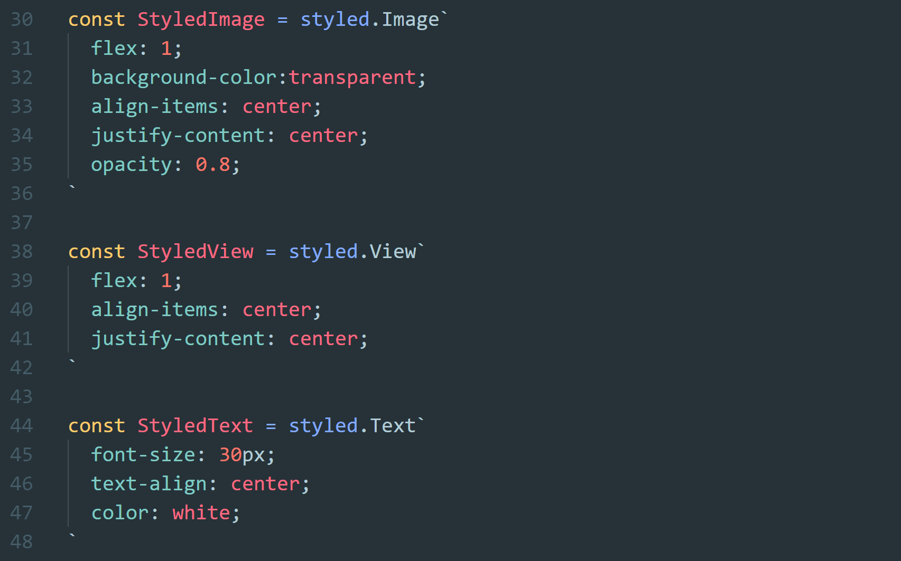

Indicator-Portfolio
===

> react-native 라이브러리를 이용한 모바일 Co2 배출량 측정 타이머

Demo
===
Motivation
===

> 환경 문제에 관심이 많다. 사실 원래는 그렇게 관심이 없었는데 뉴스를 좀 더 자주 보게 된 이후였던 것 같다. 얼마전에 어머니가 내 방에 에어콘을 달아주셨다. 에어콘을 달고보니 이 에어콘이 배출하는 이산화탄소를 측정하는 타이머를 만들었으면 좋겠다는 생각이 들었다.

Feature
===

* 타이머
* Co2 총 배출량
* 라우팅
* Tabbar

> 관리할 state가 많지 않아 Redux 구조를 쓰지 않고 state를 단순하게 관리했다. 

Styled-Component
===
> Sass나 less 같은 전처리 또는 후처리 프로세서를 사용하지 않고 스타일링 했다. Styeld-Component는 리액트의 Component가 가진 이점을 극대화 시켜준다. 사실 평소에는 관심만 가지고 있다가 처음 써본 라이브러린데 코드가 정말 깔끔하게 짜진 것 같다.


> 진짜 컴포넌트의 시대다.



> repo 소스 코드 캡쳐


Source Code
===
> [https://github.com/tjdgns8047/React-Native-Tuto](https://github.com/tjdgns8047/React-Native-Tuto)


Main Technology stack
===

* react
* react-native-router-flux
* react-native-elements
* react-native-tab-view
* styled-components

Depolyment
===
Installation
---
1. Dowload
```
$ git clone https://github.com/tjdgns8047/React-Native-Tuto.git
```
2. Set up
```
$ yarn
```
3. execute
```
$ yarn start
```